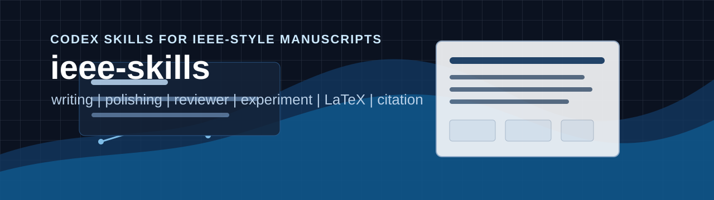

# ieee-skills

[](LICENSE)
[](skills)
[](README_EN.md)
[](https://cloudwave818.github.io/ieee-skills/)

面向 **IEEE 会议、期刊、Transactions、Letters 和工程技术论文工作流** 的 Codex skills 集合。

本项目用于辅助 IEEE 风格论文的 **写作、润色、预审、实验设计、图表检查、审稿回复、LaTeX 排版、引用核验和论文阅读**。它不是 IEEE 官方项目，而是一套非官方的 IEEE-style academic writing and review skills。

[English README](README_EN.md) | [在线介绍页](https://cloudwave818.github.io/ieee-skills/) | [安装方法](#安装) | [技能索引](#技能索引) | [典型用法](#典型用法) | [免责声明](#免责声明)

## 这是什么

`ieee-skills` 的目标不是泛泛地“帮你写论文”，而是把 IEEE 审稿中常见的硬要求拆成可复用的工作流：

```text
对象 -> 工况/约束 -> 工程危害 -> 现有方法局限 -> 方法依据 -> 实验证据
```

它更适合 AI、通信、控制、信号处理、电力电子、嵌入式、机器人、硬件系统、工程应用等 IEEE 常见方向。核心风格是 **工程问题明确、方法依据具体、实验支撑充分、图表排版专业、回复审稿克制有证据**。

## 快速开始

| 你想做什么 | 推荐 skill | 可以这样问 |
|---|---|---|
| 搭论文框架、写摘要/引言/方法 | `ieee-writing` | `Use $ieee-writing to draft an IEEE-style introduction from my problem statement and contributions.` |
| 把中文或中式英文改成 IEEE 风格 | `ieee-polishing` | `Use $ieee-polishing to polish this abstract into concise IEEE-style technical English.` |
| 投稿前模拟审稿 | `ieee-reviewer` | `Use $ieee-reviewer to evaluate this manuscript like an IEEE Transactions reviewer.` |
| 检查实验够不够 | `ieee-experiment` | `Use $ieee-experiment to check whether my experiments prove the claims in my abstract.` |
| 检查图表是否像正式论文 | `ieee-figure-table` | `Use $ieee-figure-table to audit my figures and result tables before submission.` |
| 回复审稿意见 | `ieee-response` | `Use $ieee-response to draft point-by-point responses to these reviewer comments.` |
| 修 IEEEtran / BibTeX / PDF 问题 | `ieee-latex` | `Use $ieee-latex to diagnose these IEEEtran compile and float-placement errors.` |
| 检查参考文献和引用逻辑 | `ieee-citation` | `Use $ieee-citation to audit my BibTeX entries and citation support.` |
| 精读 IEEE 论文 | `ieee-paper-reader` | `Use $ieee-paper-reader to extract contribution, method, experiments, and limitations from this paper.` |

## 技能索引

| 阶段 | Skill | 用途 |
|---|---|---|
| 第一阶段 | `ieee-writing` | 起草和重构 IEEE 论文标题、摘要、引言、Related Work、方法、实验、结论和贡献点 |
| 第一阶段 | `ieee-polishing` | IEEE 风格英文润色、中文转英文、逻辑重构、空泛表达修复 |
| 第一阶段 | `ieee-reviewer` | 模拟 IEEE 审稿人，检查 scope、novelty、validity、data、clarity、compliance、advancement |
| 第二阶段 | `ieee-experiment` | 设计和审查实验，构建 claim-evidence matrix，检查 baseline、ablation、robustness、complexity |
| 第二阶段 | `ieee-latex` | 处理 IEEEtran、编译错误、浮动体、公式、表格、算法、BibTeX 和 PDF 检查 |
| 第二阶段 | `ieee-response` | 生成审稿回复、revision plan、cover letter、point-by-point response |
| 第三阶段 | `ieee-figure-table` | 检查图表、caption、双栏可读性、灰度可读性、表格精度和第一印象风险 |
| 第三阶段 | `ieee-citation` | 检查 BibTeX、参考文献元数据、DOI、IEEE 格式、Related Work 引用逻辑 |
| 第三阶段 | `ieee-paper-reader` | 阅读 IEEE 论文，提取贡献、方法、公式、实验、局限、可复现信息和引用定位 |

## 安装

先克隆仓库：

```bash
git clone https://github.com/CloudWave818/ieee-skills.git
cd ieee-skills
```

Windows PowerShell：

```powershell
powershell -NoProfile -ExecutionPolicy Bypass -File .\scripts\update-codex-skills.ps1
```

macOS / Linux / Git Bash：

```bash
bash scripts/update-codex-skills.sh
```

默认安装到：

```text
~/.codex/skills
```

如果希望安装到其他位置：

```powershell
powershell -NoProfile -ExecutionPolicy Bypass -File .\scripts\update-codex-skills.ps1 -Dest "D:\codex-skills"
```

```bash
bash scripts/update-codex-skills.sh --dest "$HOME/.codex/skills"
```

如果仓库是用 git clone 得到的，可以顺便拉取更新：

```powershell
powershell -NoProfile -ExecutionPolicy Bypass -File .\scripts\update-codex-skills.ps1 -Pull
```

```bash
bash scripts/update-codex-skills.sh --pull
```

只检查本地 skill 结构：

```powershell
powershell -NoProfile -ExecutionPolicy Bypass -File .\scripts\update-codex-skills.ps1 -Check
```

```bash
bash scripts/update-codex-skills.sh --check
```

## 目录结构

```text
ieee-skills/
  skills/
    _shared/
      references/
    ieee-writing/
      SKILL.md
      manifest.yaml
      static/
      agents/
    ieee-polishing/
    ieee-reviewer/
    ieee-experiment/
    ieee-figure-table/
    ieee-response/
    ieee-latex/
    ieee-citation/
    ieee-paper-reader/
  scripts/
    update-codex-skills.ps1
    update-codex-skills.sh
```

`skills/` 下每个 `ieee-*` 目录都是一个可安装的 Codex skill。`skills/_shared/` 是共享规则目录，不能省略。

不要只复制 `SKILL.md`。很多 skill 依赖 `manifest.yaml`、`static/`、`agents/` 和 `_shared/references/`。

## 典型用法

```text
Use $ieee-writing to turn these notes into an IEEE-style abstract with object, method, condition, and evidence.
```

```text
Use $ieee-polishing to rewrite this paragraph in concise IEEE Transactions style and explain the main logic changes.
```

```text
Use $ieee-reviewer to give me a harsh pre-submission review and list rejection risks by severity.
```

```text
Use $ieee-experiment to build a claim-evidence matrix and tell me which experiments are missing.
```

```text
Use $ieee-figure-table to check whether these plots remain readable in a two-column IEEE layout.
```

```text
Use $ieee-response to draft a point-by-point response with evidence-added, text-only-fix, and limitation cases separated.
```

## 官方依据

本项目的规则会尽量围绕公开的 IEEE 作者资源和常见审稿逻辑组织，但不会替代目标期刊或会议的最新说明。投稿前应核对：

- [IEEE Article Templates](https://journals.ieeeauthorcenter.ieee.org/create-your-ieee-journal-article/authoring-tools-and-templates/tools-for-ieee-authors/ieee-article-templates/)
- [IEEE Editorial Style Manual](https://journals.ieeeauthorcenter.ieee.org/your-role-in-article-production/ieee-editorial-style-manual/)
- [Tools for IEEE Authors](https://journals.ieeeauthorcenter.ieee.org/create-your-ieee-journal-article/authoring-tools-and-templates/tools-for-ieee-authors/)
- 目标 IEEE 期刊、会议、Transactions、Letters 或 Magazine 的 author instructions

## 贡献与反馈

欢迎通过 GitHub Issues 提交：

- 新 skill 建议
- IEEE 写作、审稿、图表、实验、LaTeX、引用相关规则补充
- 触发词、工作流、示例 prompt 的改进
- 具体期刊或会议场景中的问题案例

暂时不放知识星球、交流群或付费入口，避免让项目主页显得像营销页。等项目有稳定用户和维护节奏后，可以再补社区入口。

## 免责声明

This project is unofficial and is not affiliated with, endorsed by, or sponsored by IEEE.

IEEE is a trademark of The Institute of Electrical and Electronics Engineers, Inc. This project only provides unofficial IEEE-style writing, review, and formatting assistance for research manuscripts.

用户应自行核对目标期刊、会议、Transactions、Letters 或 Magazine 的最新投稿指南和模板要求。

## License

MIT License. See [LICENSE](LICENSE).
