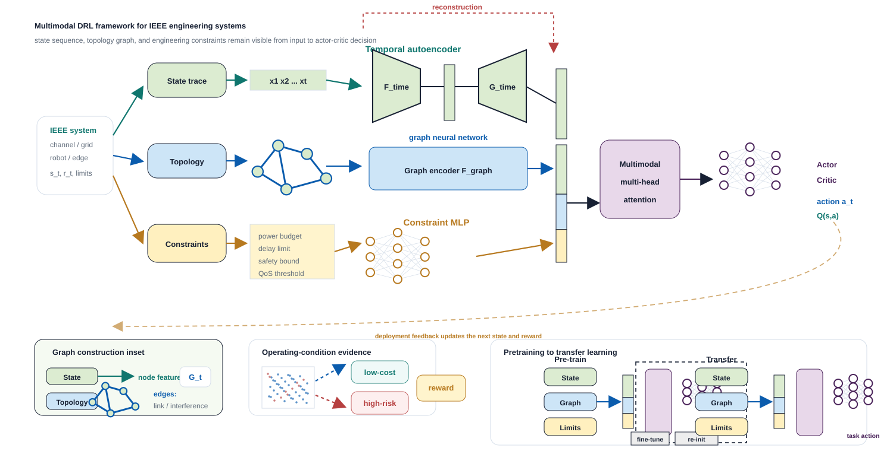

# ieee-skills

[](LICENSE)
[](skills)
[](README_EN.md)
[](https://cloudwave818.github.io/ieee-skills/)

**One IEEE manuscript, all reviewer-facing checks.**

普通润色工具帮你改句子，**ieee-skills 更关心 IEEE 审稿人会不会买账**：对象是否明确，工况是否成立，baseline 是否公平，实验是否真的支撑 claim，图表双栏缩放后是否还能读，返修回复是否有证据。

这是一组面向 **IEEE 会议、期刊、Transactions、Letters 和工程技术论文工作流** 的 Codex skills，覆盖写作、润色、预审、实验设计、图表检查、审稿回复、LaTeX 排版、引用核验和论文阅读。它不是 IEEE 官方项目，而是一套非官方的 IEEE-style academic writing and review skills。

[English README](README_EN.md) | [在线介绍页](https://cloudwave818.github.io/ieee-skills/) | [最近更新](#最近更新) | [IEEE SubmitCheck](#ieee-submitcheck) | [为什么需要它](#为什么需要它) | [示例交付物](#示例交付物) | [快速开始](#快速开始) | [安装方法](#安装)

## 最近更新

**2026-08-02：重做多模态 DRL / 神经网络框架图 demo。** `ieee-figure-table` 现在补充了一张更接近真实论文 overview 的单张大框架图：主路径展示时序状态、拓扑图、工程约束三路输入到 encoder、fusion、attention 和 actor-critic 输出；底部 inset 只补充图构建、工况证据和预训练/迁移学习细节。这个 demo 更适合迁移到通信资源分配、机器人控制、电力系统、边缘智能和智能制造等 IEEE 论文场景。

**2026-08-01：`ieee-figure-table` 作图能力升级并重做 demo。** 新增 IEEE matplotlib house-style helper，补充视觉风格、绘图 API 和 hybrid figure workflow，并按更高质量的科研绘图样例重新设计三张图：SNR 鲁棒性曲线、accuracy-latency Pareto 图、消融实验表。新版 demo 强调多面板证据组织、独立图例面板、文字边界安全区、baseline 可见性和双栏缩放后的可读性；对于机制图、流程图、组合图，也支持“Python/R 生成底图 + Illustrator/Inkscape/PowerPoint/Figma 等工具矢量精修 + edit log”的工作流。

## 这是什么

`ieee-skills` 的目标不是泛泛地“帮你写论文”，而是把 IEEE 审稿中常见的硬要求拆成可复用的工作流：

```text
对象 -> 工况/约束 -> 工程危害 -> 现有方法局限 -> 方法依据 -> 实验证据
```

它更适合 AI、通信、控制、信号处理、电力电子、嵌入式、机器人、硬件系统、工程应用等 IEEE 常见方向。核心风格是 **工程问题明确、方法依据具体、实验支撑充分、图表排版专业、回复审稿克制有证据**。

## IEEE SubmitCheck

`IEEE SubmitCheck` 是这个仓库推荐的旗舰用法：不是单独问“帮我润色一下”，而是把一篇 IEEE 手稿按审稿人会看的证据链跑一遍。

```text
manuscript draft
  -> ieee-reviewer
  -> ieee-experiment
  -> ieee-figure-table
  -> ieee-citation
  -> ieee-latex
  -> reviewer-facing revision priorities
```

一次完整检查应该输出：

- `IEEE reviewer risk report`：按 Critical / Major / Minor 排序的拒稿或大修风险
- `claim-evidence matrix`：每个核心 claim 需要什么证据、现在有什么、还缺什么实验
- `baseline fairness checklist`：传统 baseline、近期强 baseline、数据划分、调参预算是否公平
- `figure/table first-impression audit`：图表双栏可读性、caption、灰度可读性、坐标轴和表格精度问题
- `citation-support audit`：引用是否支撑当前句子，是否缺少关键 baseline 或最近工作
- `IEEEtran layout diagnosis`：浮动体、表格、公式、BibTeX、PDF 检查问题
- `revision priority list`：投稿前最值得先改的动作，而不是泛泛地“继续完善”

## 为什么需要它

IEEE 论文最容易卡住的地方，往往不是英文句子，而是工程证据链：

| 常见痛点 | 审稿人可能怎么看 | 对应 skill |
|---|---|---|
| 摘要和引言只说“提出新方法”，没有对象、工况和工程危害 | motivation 不够强，contribution 不清楚 | `ieee-writing` / `ieee-polishing` |
| 方法部分只讲怎么做，没有解释为什么适合这个系统 | method rationale 弱，像堆模块 | `ieee-writing` / `ieee-reviewer` |
| 实验很多，但没有逐条证明论文 claim | insufficient experiments，claims not supported | `ieee-experiment` |
| baseline 只选弱方法或旧方法 | comparison not convincing | `ieee-experiment` / `ieee-citation` |
| 只看 accuracy，不展示复杂度、延迟、鲁棒性、部署代价 | 工程价值不足，real-time / low-complexity claim 站不住 | `ieee-experiment` / `ieee-figure-table` |
| 图表双栏缩放后看不清、图例遮挡、caption 只描述现象 | 第一印象差，presentation weak | `ieee-figure-table` |
| IEEEtran、BibTeX、浮动体、公式、表格反复出问题 | 格式不严谨，投稿前返工 | `ieee-latex` / `ieee-citation` |
| 审稿回复只解释，不给修改、实验和稿件位置 | response 不像 revision package | `ieee-response` |

一句话：**普通 academic writing skill 主要改表达，ieee-skills 重点检查 IEEE 论文的对象、工况、baseline、实验、图表和审稿证据。**

## 示例交付物

| 你要解决的问题 | 典型输出 |
|---|---|
| 投稿前不知道会不会被审稿人卡 | [pre-submission-check.md](examples/pre-submission-check.md) |
| 实验和 claim 对不上 | [claim-evidence-matrix.md](examples/claim-evidence-matrix.md) |
| 摘要像流水账或 claim 过大 | [abstract-polishing.md](examples/abstract-polishing.md) |
| 图表不像正式 IEEE 论文 | [figure-table demos](examples/figure-table/README.md) |
| 返修不知道怎么逐点回复 | [reviewer-response.md](examples/reviewer-response.md) |
| IEEEtran、浮动体、引用和 PDF 问题 | [latex-diagnosis.md](examples/latex-diagnosis.md) |

这些示例不是虚构“录用案例”，而是展示 skill 应该交付的报告形态。你可以把自己的摘要、实验表、图表、LaTeX 日志或审稿意见替换进去。

## 五阶段工作流

```text
1. 定位问题：对象、工况、工程危害、现有方法局限
2. 写作成稿：标题、摘要、引言、Related Work、方法、结论
3. 证据补强：baseline、ablation、robustness、complexity、reproducibility
4. 投稿前预审：审稿人视角检查 novelty、validity、data、clarity、compliance
5. 返修回复：逐点回应、补实验、改图表、写 cover letter
```

## 快速开始

| 你想做什么 | 推荐 skill | 可以这样问 |
|---|---|---|
| 搭论文框架、写摘要/引言/方法 | `ieee-writing` | `Use $ieee-writing 把我的问题背景和贡献点改成 IEEE 风格 introduction。` |
| 把中文或中式英文改成 IEEE 风格 | `ieee-polishing` | `Use $ieee-polishing 润色这段摘要，但不要夸大 claim。` |
| 投稿前模拟审稿 | `ieee-reviewer` | `Use $ieee-reviewer 把我的论文当成 IEEE Transactions 审稿人预审一遍。` |
| 检查实验够不够 | `ieee-experiment` | `Use $ieee-experiment 检查我的实验是否支撑摘要里的 claim。` |
| 检查图表是否像正式论文 | `ieee-figure-table` | `Use $ieee-figure-table 看看这张图双栏缩放后会不会被审稿人嫌弃。` |
| 回复审稿意见 | `ieee-response` | `Use $ieee-response 按“修改动作 + 新证据 + 稿件位置”回复这些审稿意见。` |
| 修 IEEEtran / BibTeX / PDF 问题 | `ieee-latex` | `Use $ieee-latex 诊断这些 IEEEtran 编译、浮动体和表格问题。` |
| 检查参考文献和引用逻辑 | `ieee-citation` | `Use $ieee-citation 检查这些引用是否真的支撑 Related Work 的说法。` |
| 精读 IEEE 论文 | `ieee-paper-reader` | `Use $ieee-paper-reader 提取这篇 IEEE 论文的贡献、方法、实验和局限。` |

## 技能索引

| 阶段 | Skill | 用途 |
|---|---|---|
| 第一阶段 | `ieee-writing` | 起草和重构 IEEE 论文标题、摘要、引言、Related Work、方法、实验、结论和贡献点 |
| 第一阶段 | `ieee-polishing` | IEEE 风格英文润色、中文转英文、逻辑重构、空泛表达修复 |
| 第一阶段 | `ieee-reviewer` | 模拟 IEEE 审稿人，检查 scope、novelty、validity、data、clarity、compliance、advancement |
| 第二阶段 | `ieee-experiment` | 设计和审查实验，构建 claim-evidence matrix，检查 baseline、ablation、robustness、complexity |
| 第二阶段 | `ieee-latex` | 处理 IEEEtran、编译错误、浮动体、公式、表格、算法、BibTeX 和 PDF 检查 |
| 第二阶段 | `ieee-response` | 生成审稿回复、revision plan、cover letter、point-by-point response |
| 第三阶段 | `ieee-figure-table` | 检查图表、caption、双栏可读性、灰度可读性、表格精度、第一印象风险，并提供 IEEE matplotlib house style 与 hybrid vector finishing 工作流 |
| 第三阶段 | `ieee-citation` | 检查 BibTeX、参考文献元数据、DOI、IEEE 格式、Related Work 引用逻辑 |
| 第三阶段 | `ieee-paper-reader` | 阅读 IEEE 论文，提取贡献、方法、公式、实验、局限、可复现信息和引用定位 |

## 作图示例

`ieee-figure-table` 已支持 IEEE 风格图表审查、重画、视觉精修和可复现绘图示例。真实论文作图建议优先使用内置 matplotlib house-style helper：`skills/ieee-figure-table/scripts/ieee_plot_style.py`。它统一 IEEE 单栏/双栏尺寸、语义配色、线型/marker 冗余、panel label 和 SVG/PDF/PNG/TIFF 导出。

有些好图不应该强行端到端 Python 化。对于机制示意图、实验流程图、系统架构图、多来源组合图，可以采用 hybrid workflow：代码生成可复现的定量底图，再用 Illustrator、Inkscape、PowerPoint、Figma 或 draw.io 做矢量排版和标注，同时保留 base exports、editable layout source、final exports 和 `figure_edit_log.md`，避免“图很好看但证据不可追溯”。

目前包含四个零依赖 SVG demo。它们不是追求装饰，而是展示 **好看 + 工程证据清楚 + 双栏可读 + baseline 可见 + 文字不越界** 的 IEEE 图表方向。新版示例借鉴高质量科研绘图仓库常见的版式优点：超宽画布、清晰主路径、嵌入式 inset、独立 legend/summary 面板、短标签、克制配色和留白控制。

| 示例 | 证明的 IEEE claim | 图 |
|---|---|---|
| SNR 鲁棒性曲线 | 方法在低信噪比工况下仍保持更低 BER | [robustness-snr-curve.svg](examples/figure-table/figures/robustness-snr-curve.svg) |
| Accuracy-latency Pareto 图 | 方法在精度和推理延迟之间取得更好的工程权衡 | [accuracy-latency-pareto.svg](examples/figure-table/figures/accuracy-latency-pareto.svg) |
| 消融实验表 | 各模块对 Accuracy/F1 有贡献，同时保留部署代价指标 | [ablation-result-table.svg](examples/figure-table/figures/ablation-result-table.svg) |
| 多模态 DRL / 神经网络框架图 | 单张大图展示时序状态、拓扑图和工程约束如何进入 encoder、fusion、attention 和 actor-critic 输出 | [drl-framework-diagram.svg](examples/figure-table/figures/drl-framework-diagram.svg) |
| Hybrid 组合图工作流 | 定量底图可复现，矢量排版可编辑，手工修改可追溯 | [hybrid-workflow.md](examples/figure-table/hybrid-workflow.md) |

```bash
python examples/figure-table/generate_examples.py
```




## 安装

先克隆仓库：

```bash
git clone https://github.com/CloudWave818/ieee-skills.git
cd ieee-skills
```

Windows PowerShell：

```powershell
powershell -NoProfile -ExecutionPolicy Bypass -File .\scripts\update-codex-skills.ps1
```

macOS / Linux / Git Bash：

```bash
bash scripts/update-codex-skills.sh
```

默认安装到：

```text
~/.codex/skills
```

如果希望安装到其他位置：

```powershell
powershell -NoProfile -ExecutionPolicy Bypass -File .\scripts\update-codex-skills.ps1 -Dest "D:\codex-skills"
```

```bash
bash scripts/update-codex-skills.sh --dest "$HOME/.codex/skills"
```

如果仓库是用 git clone 得到的，可以顺便拉取更新：

```powershell
powershell -NoProfile -ExecutionPolicy Bypass -File .\scripts\update-codex-skills.ps1 -Pull
```

```bash
bash scripts/update-codex-skills.sh --pull
```

只检查本地 skill 结构：

```powershell
powershell -NoProfile -ExecutionPolicy Bypass -File .\scripts\update-codex-skills.ps1 -Check
```

```bash
bash scripts/update-codex-skills.sh --check
```

## 目录结构

```text
ieee-skills/
  skills/
    _shared/
      references/
    ieee-writing/
      SKILL.md
      manifest.yaml
      static/
      agents/
    ieee-polishing/
    ieee-reviewer/
    ieee-experiment/
    ieee-figure-table/
    ieee-response/
    ieee-latex/
    ieee-citation/
    ieee-paper-reader/
  scripts/
    update-codex-skills.ps1
    update-codex-skills.sh
```

`skills/` 下每个 `ieee-*` 目录都是一个可安装的 Codex skill。`skills/_shared/` 是共享规则目录，不能省略。

不要只复制 `SKILL.md`。很多 skill 依赖 `manifest.yaml`、`static/`、`agents/` 和 `_shared/references/`。

## 典型用法

```text
Use $ieee-writing to turn these notes into an IEEE-style abstract with object, method, condition, and evidence.
```

```text
Use $ieee-polishing to rewrite this paragraph in concise IEEE Transactions style and explain the main logic changes.
```

```text
Use $ieee-reviewer to give me a harsh pre-submission review and list rejection risks by severity.
```

```text
Use $ieee-experiment to build a claim-evidence matrix and tell me which experiments are missing.
```

```text
Use $ieee-figure-table to check whether these plots remain readable in a two-column IEEE layout.
```

```text
Use $ieee-response to draft a point-by-point response with evidence-added, text-only-fix, and limitation cases separated.
```

## 官方依据

本项目的规则会尽量围绕公开的 IEEE 作者资源和常见审稿逻辑组织，但不会替代目标期刊或会议的最新说明。投稿前应核对：

- [IEEE Article Templates](https://journals.ieeeauthorcenter.ieee.org/create-your-ieee-journal-article/authoring-tools-and-templates/tools-for-ieee-authors/ieee-article-templates/)
- [IEEE Editorial Style Manual](https://journals.ieeeauthorcenter.ieee.org/your-role-in-article-production/ieee-editorial-style-manual/)
- [Tools for IEEE Authors](https://journals.ieeeauthorcenter.ieee.org/create-your-ieee-journal-article/authoring-tools-and-templates/tools-for-ieee-authors/)
- 目标 IEEE 期刊、会议、Transactions、Letters 或 Magazine 的 author instructions

## 贡献与反馈

欢迎通过 GitHub Issues 提交：

- 新 skill 建议
- IEEE 写作、审稿、图表、实验、LaTeX、引用相关规则补充
- 触发词、工作流、示例 prompt 的改进
- 具体期刊或会议场景中的问题案例

暂时不放知识星球、交流群或付费入口，避免让项目主页显得像营销页。等项目有稳定用户和维护节奏后，可以再补社区入口。

## 免责声明

This project is unofficial and is not affiliated with, endorsed by, or sponsored by IEEE.

IEEE is a trademark of The Institute of Electrical and Electronics Engineers, Inc. This project only provides unofficial IEEE-style writing, review, and formatting assistance for research manuscripts.

用户应自行核对目标期刊、会议、Transactions、Letters 或 Magazine 的最新投稿指南和模板要求。

## License

MIT License. See [LICENSE](LICENSE).
