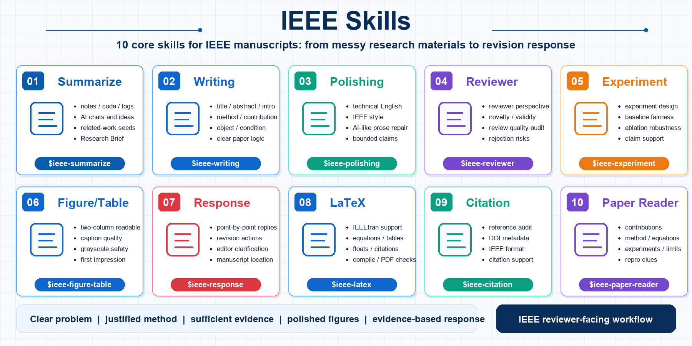
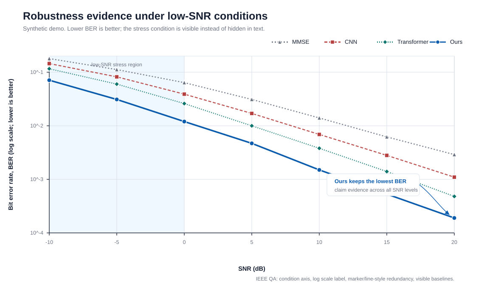
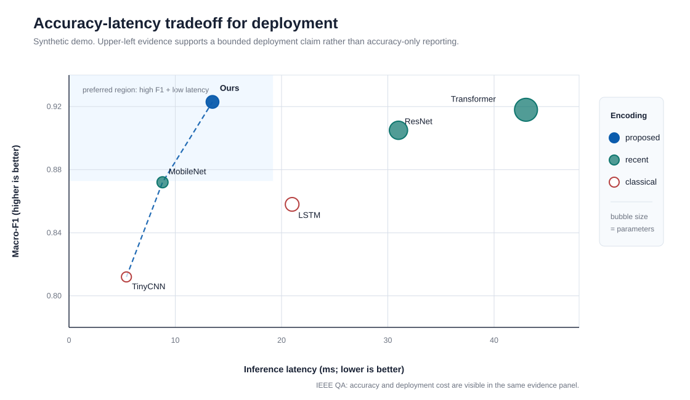
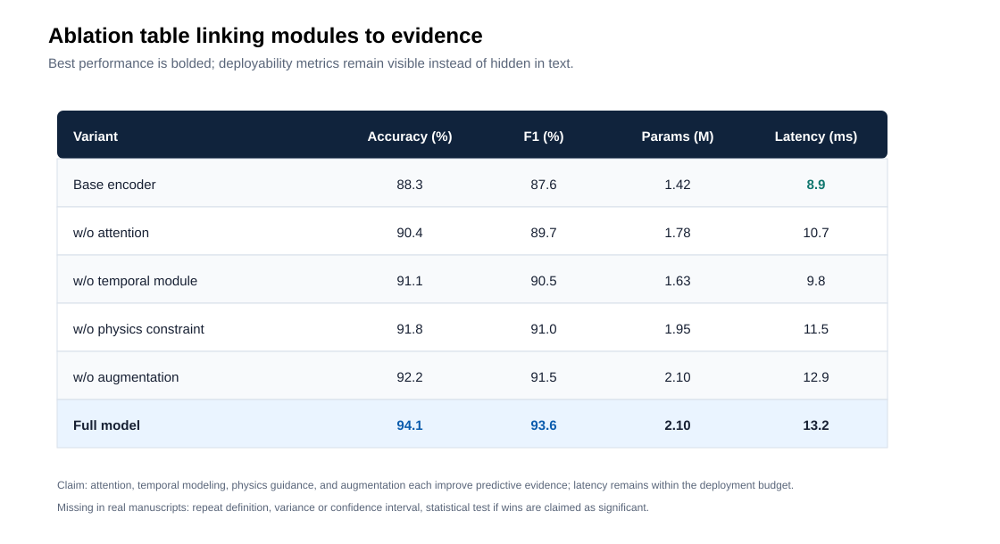

# ieee-skills

[](LICENSE)
[](skills)
[](README.md)
[](https://cloudwave818.github.io/ieee-skills/)

**One IEEE manuscript, all reviewer-facing checks.**

Generic polishing tools improve sentences. **ieee-skills checks whether an IEEE reviewer is likely to buy the engineering evidence**: whether the object is clear, the operating condition is real, baselines are fair, experiments support the claims, figures survive IEEE column scaling, and revision responses provide concrete evidence.

This is a Codex skill collection for **IEEE-style conference, journal, Transactions, Letters, and engineering manuscript workflows**. It helps with writing, polishing, reviewer-style assessment, experiments, figure/table quality, revision responses, LaTeX, citations, and paper reading. It is an unofficial IEEE-style skill collection, not an IEEE project.

[中文 README](README.md) | [Project Page](https://cloudwave818.github.io/ieee-skills/) | [IEEE SubmitCheck](#ieee-submitcheck) | [Why It Exists](#why-it-exists) | [Example Deliverables](#example-deliverables) | [Quick Start](#quick-start) | [Installation](#installation)

## What It Does

`ieee-skills` turns common IEEE manuscript risks into reusable Codex workflows:

```text
object -> condition/constraint -> engineering harm -> prior limitation -> method rationale -> experimental evidence
```

It is suitable for AI, communications, control, signal processing, power and energy, embedded systems, robotics, circuits, hardware systems, and applied engineering papers. The guiding style is **specific engineering framing, justified method choices, adequate experimental evidence, professional visual presentation, and disciplined reviewer response**.

## IEEE SubmitCheck

`IEEE SubmitCheck` is the recommended flagship workflow for this repository. Instead of asking only for sentence polishing, run a manuscript through the evidence chain that IEEE reviewers usually inspect.

```text
manuscript draft
  -> ieee-reviewer
  -> ieee-experiment
  -> ieee-figure-table
  -> ieee-citation
  -> ieee-latex
  -> reviewer-facing revision priorities
```

A full check should produce:

- `IEEE reviewer risk report`: rejection or major-revision risks ranked as Critical / Major / Minor
- `claim-evidence matrix`: what evidence each central claim needs, what exists, and what experiment is missing
- `baseline fairness checklist`: traditional baselines, recent strong baselines, data splits, and tuning fairness
- `figure/table first-impression audit`: two-column readability, captions, grayscale accessibility, axes, and table precision
- `citation-support audit`: whether citations support local claims and whether key baselines or recent work are missing
- `IEEEtran layout diagnosis`: floats, tables, equations, BibTeX, and final PDF checks
- `revision priority list`: the highest-impact actions before submission

## Why It Exists

IEEE manuscript problems are often not only language problems. They are engineering-evidence problems.

| Common pain point | Reviewer risk | Skill |
|---|---|---|
| Abstract/introduction lacks object, condition, and engineering harm | weak motivation, unclear contribution | `ieee-writing` / `ieee-polishing` |
| Method section explains what was done but not why it fits the system | weak method rationale, module stacking | `ieee-writing` / `ieee-reviewer` |
| Many experiments exist but do not prove the stated claims | insufficient experiments, unsupported claims | `ieee-experiment` |
| Baselines are weak, old, or unfair | comparison not convincing | `ieee-experiment` / `ieee-citation` |
| Accuracy improves but complexity, latency, robustness, or deployment cost is hidden | weak engineering value | `ieee-experiment` / `ieee-figure-table` |
| Figures fail after IEEE two-column scaling | weak presentation and poor first impression | `ieee-figure-table` |
| IEEEtran, BibTeX, floats, equations, and tables keep breaking | formatting and submission friction | `ieee-latex` / `ieee-citation` |
| Reviewer response explains but does not show concrete revision evidence | weak revision package | `ieee-response` |

In short: **generic academic-writing skills mostly polish expression; ieee-skills checks the IEEE-specific chain of object, condition, baseline, experiment, figure, and reviewer evidence.**

## Example Deliverables

| Problem | Typical output |
|---|---|
| Unsure whether reviewers will object before submission | [pre-submission-check.md](examples/pre-submission-check.md) |
| Experiments do not clearly support claims | [claim-evidence-matrix.md](examples/claim-evidence-matrix.md) |
| Abstract reads like a vague summary or overclaims | [abstract-polishing.md](examples/abstract-polishing.md) |
| Figures/tables do not look like a polished IEEE manuscript | [figure-table demos](examples/figure-table/README.md) |
| Revision response is hard to organize | [reviewer-response.md](examples/reviewer-response.md) |
| IEEEtran, floats, references, or PDF checks block submission | [latex-diagnosis.md](examples/latex-diagnosis.md) |

These files are templates and example report shapes, not claimed accepted-paper cases. Replace the placeholders with your own abstract, experiments, figures, LaTeX logs, references, or reviewer comments.

## Five-Stage Workflow

```text
1. Frame the problem: object, condition, engineering harm, prior limitation
2. Draft the paper: title, abstract, introduction, related work, method, conclusion
3. Strengthen evidence: baselines, ablations, robustness, complexity, reproducibility
4. Pre-review: novelty, validity, data, clarity, compliance, advancement
5. Revise and respond: point-by-point response, added evidence, figures, cover letter
```

## Quick Start

| Goal | Skill | Prompt |
|---|---|---|
| Draft a paper section | `ieee-writing` | `Use $ieee-writing to draft an IEEE-style introduction from my problem statement and contributions.` |
| Polish technical prose | `ieee-polishing` | `Use $ieee-polishing to polish this abstract into concise IEEE-style technical English.` |
| Run a pre-submission review | `ieee-reviewer` | `Use $ieee-reviewer to evaluate this manuscript like an IEEE Transactions reviewer.` |
| Strengthen experiments | `ieee-experiment` | `Use $ieee-experiment to check whether my experiments prove the claims in my abstract.` |
| Audit figures and tables | `ieee-figure-table` | `Use $ieee-figure-table to audit my figures and result tables before submission.` |
| Respond to reviewers | `ieee-response` | `Use $ieee-response to draft point-by-point responses to these reviewer comments.` |
| Fix IEEEtran issues | `ieee-latex` | `Use $ieee-latex to diagnose these IEEEtran compile and float-placement errors.` |
| Clean references | `ieee-citation` | `Use $ieee-citation to audit my BibTeX entries and citation support.` |
| Read an IEEE paper | `ieee-paper-reader` | `Use $ieee-paper-reader to extract contribution, method, experiments, and limitations from this paper.` |

## Skills

| Stage | Skill | Purpose |
|---|---|---|
| Stage 1 | `ieee-writing` | Draft and restructure IEEE-style titles, abstracts, introductions, related work, methods, experiments, conclusions, and contribution statements |
| Stage 1 | `ieee-polishing` | Polish or translate technical prose into precise IEEE-style English |
| Stage 1 | `ieee-reviewer` | Simulate IEEE-style technical review across scope, novelty, validity, data, clarity, compliance, and advancement |
| Stage 2 | `ieee-experiment` | Audit claim-evidence alignment, baselines, ablations, robustness, complexity, and reproducibility |
| Stage 2 | `ieee-latex` | Fix IEEEtran LaTeX, floats, equations, tables, algorithms, BibTeX, and PDF checks |
| Stage 2 | `ieee-response` | Draft point-by-point responses, rebuttals, revision plans, and cover letters |
| Stage 3 | `ieee-figure-table` | Audit figures, tables, captions, two-column readability, accessibility, and first-impression risks |
| Stage 3 | `ieee-citation` | Check BibTeX, reference metadata, DOI fields, IEEE style, and citation logic |
| Stage 3 | `ieee-paper-reader` | Extract contributions, methods, equations, experiments, limitations, reproducibility details, and citation positioning |

## Figure Examples

`ieee-figure-table` now includes IEEE-style figure/table audit, redraw, visual polish, and reproducible plotting examples. For real manuscript figures, use the bundled matplotlib house-style helper at `skills/ieee-figure-table/scripts/ieee_plot_style.py`; it standardizes IEEE column sizes, semantic colors, line/marker redundancy, panel labels, and SVG/PDF/PNG/TIFF export.

The repository also includes three zero-dependency SVG demos:

| Example | IEEE Claim | Figure |
|---|---|---|
| Robustness SNR curve | The method keeps lower BER under low-SNR operating conditions. | [robustness-snr-curve.svg](examples/figure-table/figures/robustness-snr-curve.svg) |
| Accuracy-latency Pareto | The method provides a better engineering tradeoff between accuracy and inference latency. | [accuracy-latency-pareto.svg](examples/figure-table/figures/accuracy-latency-pareto.svg) |
| Ablation result table | Each module contributes to Accuracy/F1 while deployment-cost metrics remain visible. | [ablation-result-table.svg](examples/figure-table/figures/ablation-result-table.svg) |

```bash
python examples/figure-table/generate_examples.py
```







## Installation

Clone the repository:

```bash
git clone https://github.com/CloudWave818/ieee-skills.git
cd ieee-skills
```

Windows PowerShell:

```powershell
powershell -NoProfile -ExecutionPolicy Bypass -File .\scripts\update-codex-skills.ps1
```

macOS / Linux / Git Bash:

```bash
bash scripts/update-codex-skills.sh
```

The default destination is:

```text
~/.codex/skills
```

Custom destination:

```powershell
powershell -NoProfile -ExecutionPolicy Bypass -File .\scripts\update-codex-skills.ps1 -Dest "D:\codex-skills"
```

```bash
bash scripts/update-codex-skills.sh --dest "$HOME/.codex/skills"
```

Pull updates before installing:

```powershell
powershell -NoProfile -ExecutionPolicy Bypass -File .\scripts\update-codex-skills.ps1 -Pull
```

```bash
bash scripts/update-codex-skills.sh --pull
```

Check local skill structure:

```powershell
powershell -NoProfile -ExecutionPolicy Bypass -File .\scripts\update-codex-skills.ps1 -Check
```

```bash
bash scripts/update-codex-skills.sh --check
```

## Repository Layout

```text
ieee-skills/
  skills/
    _shared/
      references/
    ieee-writing/
      SKILL.md
      manifest.yaml
      static/
      agents/
    ieee-polishing/
    ieee-reviewer/
    ieee-experiment/
    ieee-figure-table/
    ieee-response/
    ieee-latex/
    ieee-citation/
    ieee-paper-reader/
  scripts/
    update-codex-skills.ps1
    update-codex-skills.sh
```

Each `ieee-*` directory under `skills/` is an installable Codex skill. The `skills/_shared/` directory contains shared references and must be installed with the skills.

Do not copy only `SKILL.md`. Many skills depend on `manifest.yaml`, `static/`, `agents/`, and `_shared/references/`.

## Example Prompts

```text
Use $ieee-writing to turn these notes into an IEEE-style abstract with object, method, condition, and evidence.
```

```text
Use $ieee-reviewer to give me a harsh pre-submission review and list rejection risks by severity.
```

```text
Use $ieee-experiment to build a claim-evidence matrix and tell me which experiments are missing.
```

```text
Use $ieee-response to draft a point-by-point response with evidence-added, text-only-fix, and limitation cases separated.
```

## Source Basis

The project is organized around public IEEE author resources and common IEEE-style review logic, but it does not replace the latest instructions from a target venue. Before submission, check:

- [IEEE Article Templates](https://journals.ieeeauthorcenter.ieee.org/create-your-ieee-journal-article/authoring-tools-and-templates/tools-for-ieee-authors/ieee-article-templates/)
- [IEEE Editorial Style Manual](https://journals.ieeeauthorcenter.ieee.org/your-role-in-article-production/ieee-editorial-style-manual/)
- [Tools for IEEE Authors](https://journals.ieeeauthorcenter.ieee.org/create-your-ieee-journal-article/authoring-tools-and-templates/tools-for-ieee-authors/)
- The author instructions for the target IEEE journal, conference, Transactions, Letters, or Magazine

## Contributing

GitHub Issues are welcome for new skills, workflow improvements, IEEE writing rules, LaTeX cases, citation checks, and concrete venue-specific examples.

## Disclaimer

This project is unofficial and is not affiliated with, endorsed by, or sponsored by IEEE.

IEEE is a trademark of The Institute of Electrical and Electronics Engineers, Inc. This project only provides unofficial IEEE-style writing, review, and formatting assistance for research manuscripts.

Users must check the latest requirements of their target IEEE journal, conference, Transactions, Letters, or Magazine.

## License

MIT License. See [LICENSE](LICENSE).
